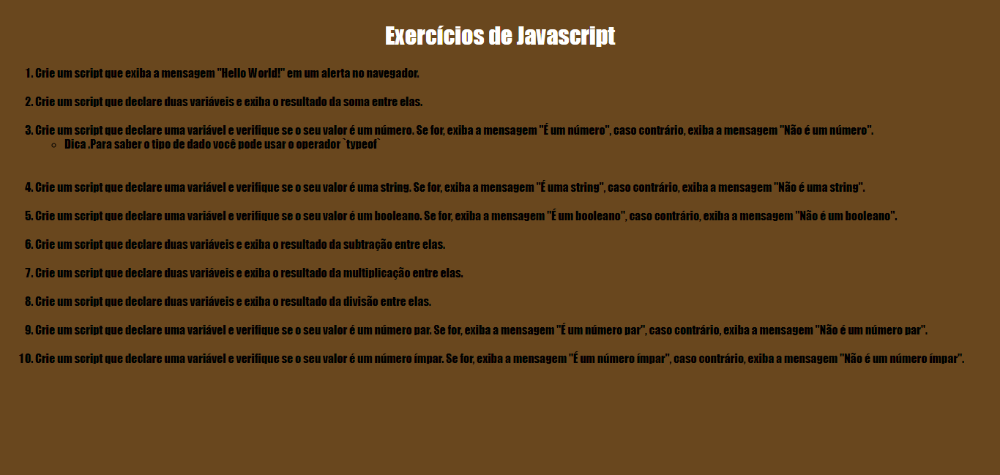

# explorer-intensivao-desafio-js
 Aplicar os conceitos básicos do javascript
 

  

## 🖥️ Projeto
Uma sérei de exercícios para trabalhar os conceitos aprendidos desde o stage 1 ao 4, alguns que posso cita são: declarar variável, descobrir o tipo de dado com o typeof, operações matemáticas, condicionais e o operador ternário.

## 🚀 Tecnologias
Foi desenvolvido esse projeto com as seguintes tecnologias:

- HTML
- CSS
- JAVASCRIPT
- GIT
- GITHUB 
